<div align="center">


<h1>Code Island</h1>

<p><b>Turn your MacBook's notch into a live dashboard for your AI coding agents.</b></p>

<p>Approve permissions, answer questions, track rate limits, and jump between<br/>terminals — all from the notch. Works with <b>17 AI coding agents</b> — Claude Code, Codex, Gemini, Cursor, Copilot, and more — out of the box.</p>

<p>


</p>

<br/>

<!-- Demo GIF is hosted as a GitHub release asset (tag: media), not committed to
     the repo, so clones/pulls stay small. -->


</div>

## Features

- **17 AI coding agents** — Claude Code, Codex, Gemini, Qwen, Qoder, Factory, CodeBuddy, Cursor, Copilot, Kimi, OpenCode, Cline, Kiro, Pi, Oh My Pi, AntiGravity, and Hermes — side by side in one notch
- **Live session tracking** — every running agent visible at a glance, grouped by provider
- **Permission UI** — approve, deny, allow-all, or bypass from the notch without switching apps
- **Question UI** — Claude's `AskUserQuestion` and Codex's `request_user_input` surfaced inline; click to answer (Claude) or jump to the app (Codex)
- **Finished notifications** — see the agent's reply inline when a task completes
- **Markdown replies** — agent responses render markdown in the notch: headers, **bold**/*italic*, `code` + fenced code blocks, tables, bullet/numbered/task lists, and blockquotes
- **Per-provider rate limits** — 5h / 7d usage with color-coded warnings; tap to cycle providers
- **Permission queue** — multiple agents' permissions queue automatically
- **Claude multi-profile** — auto-installs into `~/.claude` *and* every `~/.claude-*` profile (`CLAUDE_CONFIG_DIR` targets); sessions are labeled by profile (e.g. `work` / `personal`)
- **Terminal jump** — click a session card to jump back to the terminal/IDE running it
- **Dynamic terminal detection** — iTerm2, Ghostty, Terminal.app, VS Code, JetBrains, Codex.app, and more
- **8-bit sound effects** — per-event sound picker (built-in chime / off / your own), an in-app sound library with an "Add Sound…" importer, and ▶ previews
- **Pixel-art mascots** — every agent gets its own hand-drawn pixel mascot that animates by status
- **Notch themes** — 5 looks (Default, Liquid Glass, Retro Pixel, Terminal, Neo-Brutalist), switch live in Settings → Appearance
- **Works without a notch** — on Macs with a notch the panel sits in the notch; on external displays / older Macs it shows as a compact bar at the top center

## Supported Tools

Code Island auto-installs hooks for every agent it detects on launch — install one and it just shows up in the notch. Hooks are written idempotently and never clobber existing config: foreign hooks are preserved and the original is backed up to `.bak`.

| Mascot | Tool | Events | Jump-to | Permission / question UI |
|:------:|------|:------:|:-------:|:------------------------:|
| 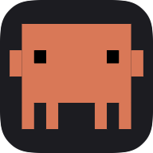 | 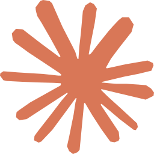 **Claude Code** | full | ✅ | ✅ |
| 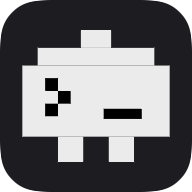 | 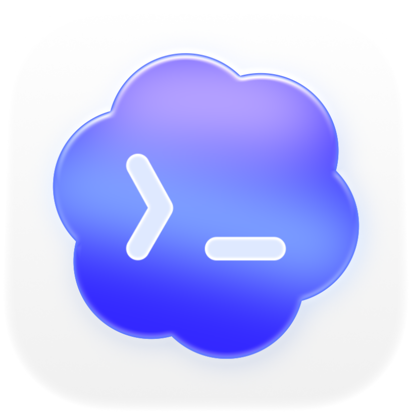 **Codex** (CLI + app) | full | ✅ | ✅ |
| 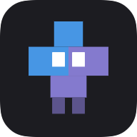 | 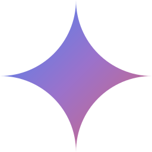 **Gemini CLI** | 6 | ✅ | — |
| 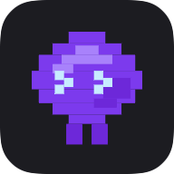 |  **Qwen Code** | full | ✅ | ✅ |
| 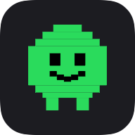 | 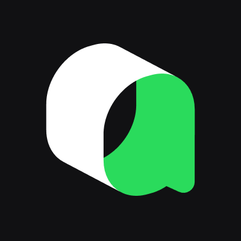 **Qoder** | 5 | ✅ | — |
| 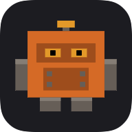 |  **Factory** (`droid`) | 9 | ✅ | — |
| 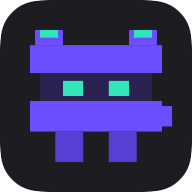 | 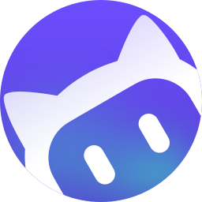 **CodeBuddy** | 10 | ✅ | — |
| 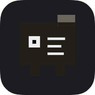 | 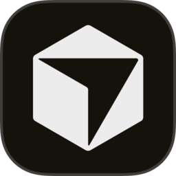 **Cursor** | 10 | ✅ | — |
| 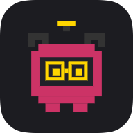 | 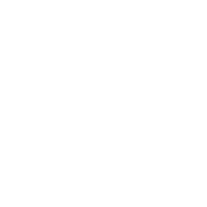 **Copilot** | 7 | ✅ | — |
| 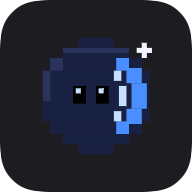 |  **Kimi Code CLI** | 10 | ✅ | — |
| 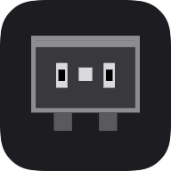 |  **OpenCode** | all | ✅ | ✅ |
| 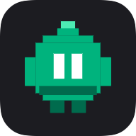 |  **Cline** | 7 | ✅ | — |
| 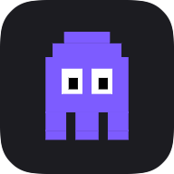 | 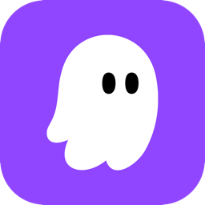 **Kiro** | 5 | ✅ | — |
| 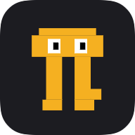 |  **Pi** | all | ✅ | ✅ |
| 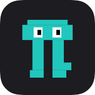 | 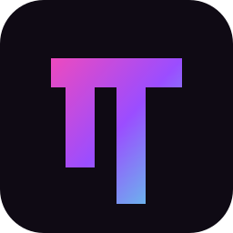 **Oh My Pi** | all | ✅ | ✅ |
| 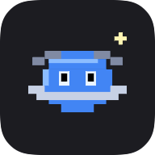 |  **AntiGravity** | 4 | ✅ | — |
| 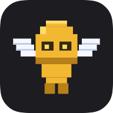 |  **Hermes** | 6 | ✅ | — |

**Jump-to works for every agent** — there's no per-tool jump config. The bridge tags each session with the host app it detected by walking the process tree, and clicking a card brings you straight there. **iTerm2, Terminal.app, Ghostty, JetBrains IDEs, VS Code, Cursor, and Windsurf** get tab/window-level precision; any other terminal or app is brought to the front.

**Permission / question UI** ✅ marks the agents that surface approve/deny (and questions) directly in the notch — Claude, Codex, Qwen, OpenCode, and Pi / Oh My Pi (the last two prompt on risky shell commands). Codex, Hermes, and Oh My Pi also mirror their question prompts in the notch with a jump-to-answer. Gemini, Cursor, Copilot, Kimi, AntiGravity, Hermes, and Qoder expose only blanket "before every tool" hooks — turn those into in-notch approve/deny with the opt-in **"Review every action"** mode (Settings → General). The rest (Factory, CodeBuddy, Cline, Kiro) handle approvals in-tool; Code Island still tracks their sessions, tools, and completions.

## Requirements

- macOS 14 (Sonoma) or later
- At least one supported AI coding agent (see [Supported Tools](#supported-tools))

## Installation

1. Download the latest DMG from [Releases](https://github.com/rifqiakrm/code-island/releases)
2. Drag `Code Island.app` to Applications
3. **For unsigned builds**, run this first to bypass Gatekeeper:
   ```bash
   xattr -cr /Applications/Code\ Island.app
   ```
4. Launch Code Island — hooks for every detected provider install automatically
5. Start a session in any supported agent and watch the notch come alive

## How It Works

1. The agent fires hooks (`SessionStart`, `Stop`, `PreToolUse`, `PermissionRequest`, etc.)
2. Hook calls the matching launcher in `~/.code-island/bin/` (e.g. `code-island-bridge` for Claude, `code-island-cursor-bridge` for Cursor) with JSON on stdin
3. Bridge normalizes each tool's event vocabulary to a canonical set, enriches the payload (terminal detection via process tree walk, `--source` tagging), and forwards it to the app via Unix socket at `/tmp/code-island.sock`
4. For `PermissionRequest`: the socket connection stays open, the app sends a response back, and the bridge writes it to stdout for the agent
5. For Codex's `request_user_input` (multi-choice questions): the question is mirrored in the notch; clicking activates Codex.app so you can answer there

## Themes

Open **Settings → Appearance** to restyle the notch windows. Switching is instant — no restart.

- **Default** — the original: pure black, monospaced, soft rounded cards
- **Liquid Glass** — frosted translucency and pill controls, native macOS feel
- **Retro Pixel** — 8-bit chunky borders, square corners, colored hard shadows
- **Terminal** — pure black with hairline chrome, disappears into the notch
- **Neo-Brutalist** — bold light cards, thick black borders, hard shadows, cream code wells

Themes only restyle the *chrome*. Your mascots, status colors, and rate-limit warnings stay consistent across all of them. New installs start on **Default**.

## Architecture

```
Code Island.app/
├── Contents/
│   ├── MacOS/Code Island                ← Main SwiftUI app (menu bar + notch panel)
│   ├── Helpers/CodeIslandBridge         ← CLI bridge: normalizes every provider's hooks (--source flag)
│   └── Info.plist                       ← LSUIElement=true (no dock icon)
└── ~/.code-island/
    ├── bin/code-island-<agent>-bridge   ← one zsh launcher per agent (claude, codex, gemini, cursor, …)
    ├── config.json                      ← strict-approval flags (read by the bridge)
    ├── cache/rl.json                    ← Cached rate limits
    ├── debug.log                        ← Runtime log
    └── sound-packs/                     ← Custom sound files
```

Hooks live in each agent's own config — Code Island writes them idempotently, preserving any existing hooks and backing up the original to `.bak`. A few examples:
- `~/.claude/settings.json` (Claude Code)
- `~/.codex/hooks.json` + `[features].hooks = true` in `~/.codex/config.toml` (Codex)
- `~/.gemini/settings.json`, `~/.cursor/hooks.json`, `~/.config/opencode/` (plugin), `~/.kimi/config.toml`, `~/Documents/Cline/Hooks/`, …

**Tech stack:** Swift 5.9+, SwiftUI + AppKit, macOS 14.0+, Swift Package Manager, POSIX sockets, `AVAudioEngine` for 8-bit sound synthesis.

## Building from Source

```bash
# Debug build
swift build

# Release build
swift build -c release

# Run debug
.build/debug/CodeIsland
```

To build the DMG installer (requires `create-dmg`):

```bash
brew install create-dmg
./scripts/build-dmg.sh 1.0.0   # produces build/Code-Island-1.0.0.dmg
```

## Development

- **Kill and relaunch:** `pkill -9 CodeIsland; rm -f /tmp/code-island.sock; .build/debug/CodeIsland &`
- **Reset onboarding:** `defaults delete dev.codeisland.macos`
- **Debug log:** `tail -f ~/.code-island/debug.log`
- **Test bridge:** `echo '{"session_id":"test","hook_event_name":"SessionStart","cwd":"/tmp"}' | .build/debug/CodeIslandBridge`
- **Test Codex bridge:** add `--source codex` to the bridge invocation above

See [CLAUDE.md](CLAUDE.md) for detailed architecture notes, IPC payload shapes, and provider-specific quirks.

## Contributing

PRs welcome! Code Island already ships 17 agents (see [Supported Tools](#supported-tools)) — here's where help is most useful:

**Add another provider.** 17 agents ship today; **DeepSeek** and **Amp** are the notable holdouts (DeepSeek has no official hookable CLI; Amp needs a dedicated plugin — both deferred to avoid shipping a flaky integration). Adding a new one is mostly data + a mascot:

1. An `AIProvider` entry (id, accent color, mascot) in `Sources/CodeIsland/Session/AIProvider.swift`
2. A `PixelMascot` shape + idle/active palette in `Sources/CodeIsland/Notch/Views/PixelMascot.swift`
3. A `ProviderInstaller.Descriptor` (config path, format, timeout unit, events) in `Sources/CodeIsland/Utilities/ProviderInstaller.swift` — or a new `Format` case if the tool's config is exotic (TOML, JS plugin, bash scripts all have precedents)
4. Event-name normalization in `Sources/CodeIslandBridge/main.swift` if the tool's hook vocabulary differs from the canonical set
5. A CLI icon at `Resources/cli-icons/<id>.png`

See [CLAUDE.md](CLAUDE.md) for the full provider-abstraction notes.

**Test & verify the agents.** This is the single most useful thing you can do. Each integration is verified against the tool's official hook docs, but I only use **Claude Code, Codex, and Qwen** day-to-day — those three are battle-tested; the other 14 are verified against docs but only lightly smoke-tested. If you actively use any of them, please put it through its paces (sessions, tool tracking, prompt/reply text, permission/strict-approval flows, jump-to) and open an issue when something's off or could be richer. Real-world reports on the agents I can't run regularly are gold.

**Other ideas**

- Per-provider rate limits — today the live rate-limit bar only covers Claude and Codex (their usage APIs). Wiring up the other providers' usage/quota endpoints (where they exist) is wide open
- In-notch permission ("review every action") support for more of the blanket-hook tools
- Session history view
- Multi-display notch support
- Security hardening
- More themes and sound packs

If an issue or PR is valuable, we're happy to pick it up or merge it.

## Support the project

Code Island is free and built in my spare time. If it's saved you a few context-switches and you'd like to chip in, it's hugely appreciated (and totally optional) — thank you! ☕

[](https://ko-fi.com/rifqiakrm)
[](https://paypal.me/rifqiakrm)

- **Ko-fi** — https://ko-fi.com/rifqiakrm
- **PayPal** — https://paypal.me/rifqiakrm

## License

**Free & open source under the [GNU GPLv3](LICENSE).** © 2026 Rifqi Akram.

You're free to use, modify, and redistribute it — with one condition: any distributed fork or derivative must also be open source under GPLv3 (it can't be closed-sourced or shipped proprietary).

## Acknowledgements

- [Vibe Island](https://vibeisland.app) — the original inspiration for a notch-based agent dashboard
- [Vibe Notch](https://github.com/farouqaldori/vibe-notch) by [@farouqaldori](https://github.com/farouqaldori) — the notch mascot is taken directly from this project

Code Island is an independent project and is not affiliated with or endorsed by any of the above.
