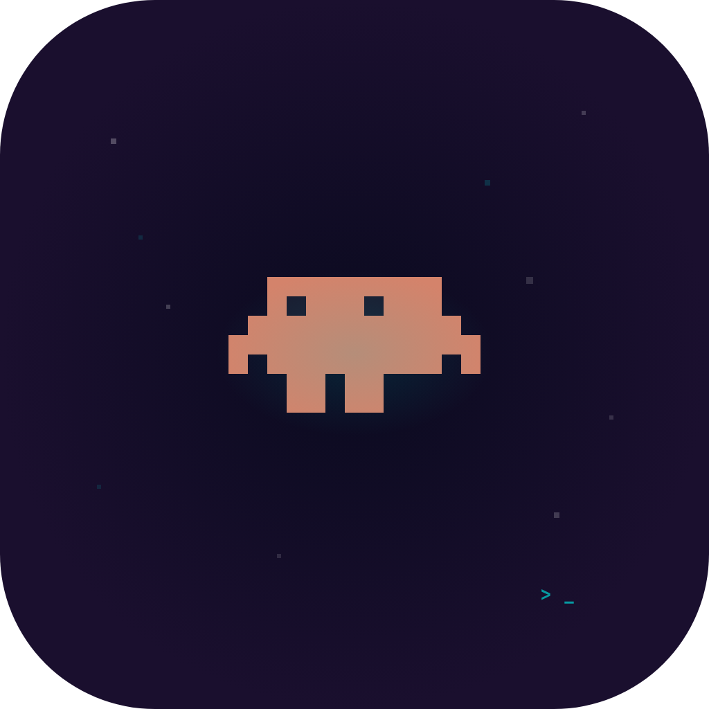

# Code Island

A native macOS app that turns your MacBook's notch into a live dashboard for your AI coding agents. Approve permissions, answer questions, track rate limits, and jump between terminals — all from the notch.

Works with **Claude Code** and **OpenAI Codex** out of the box.



## Features

- **Multi-provider** — Claude Code and Codex (CLI + GUI) side by side in one notch
- **Live session tracking** — every running agent visible at a glance, grouped by provider
- **Permission UI** — approve, deny, allow-all, or bypass from the notch without switching apps
- **Question UI** — Claude's `AskUserQuestion` and Codex's `request_user_input` surfaced inline; click to answer (Claude) or jump to the app (Codex)
- **Finished notifications** — see the agent's reply inline when a task completes
- **Per-provider rate limits** — 5h / 7d usage with color-coded warnings; tap to cycle providers
- **Permission queue** — multiple agents' permissions queue automatically
- **Terminal jump** — click a session card to jump back to the terminal/IDE running it
- **Dynamic terminal detection** — iTerm2, Ghostty, Terminal.app, VS Code, JetBrains, Codex.app, and more
- **8-bit sound effects** — per-event toggles with optional custom sound packs
- **Pixel-art mascots** — Claude (crab) and Codex (terminal box) animate by status

## Requirements

- macOS 14 (Sonoma) or later
- At least one of: Claude Code, Codex CLI, or Codex.app

## Installation

1. Download the latest DMG from [Releases](https://github.com/rifqiakrm/code-island/releases)
2. Drag `Code Island.app` to Applications
3. **For unsigned builds**, run this first to bypass Gatekeeper:
   ```bash
   xattr -cr /Applications/Code\ Island.app
   ```
4. Launch Code Island — hooks for every detected provider install automatically
5. Start a session in Claude Code or Codex and watch the notch come alive

## How It Works

1. The agent fires hooks (`SessionStart`, `Stop`, `PreToolUse`, `PermissionRequest`, etc.)
2. Hook calls `~/.code-island/bin/code-island-bridge` (Claude) or `code-island-codex-bridge` (Codex) with JSON on stdin
3. Bridge enriches the payload (terminal detection via process tree walk, `--source` flag tagging) and forwards it to the app via Unix socket at `/tmp/code-island.sock`
4. For `PermissionRequest`: the socket connection stays open, the app sends a response back, and the bridge writes it to stdout for the agent
5. For Codex's `request_user_input` (multi-choice questions): the question is mirrored in the notch; clicking activates Codex.app so you can answer there

## Architecture

```
Code Island.app/
├── Contents/
│   ├── MacOS/Code Island                ← Main SwiftUI app (menu bar + notch panel)
│   ├── Helpers/CodeIslandBridge         ← CLI bridge (Claude + Codex hooks, --source flag)
│   └── Info.plist                       ← LSUIElement=true (no dock icon)
└── ~/.code-island/
    ├── bin/code-island-bridge           ← Claude launcher (zsh shim)
    ├── bin/code-island-codex-bridge     ← Codex launcher (passes --source codex)
    ├── cache/rl.json                    ← Cached rate limits
    ├── debug.log                        ← Runtime log
    └── sound-packs/                     ← Custom sound files
```

Hooks live at:
- `~/.claude/settings.json` (Claude Code)
- `~/.codex/hooks.json` + `[features].hooks = true` in `~/.codex/config.toml` (Codex)

**Tech stack:** Swift 5.9+, SwiftUI + AppKit, macOS 14.0+, Swift Package Manager, POSIX sockets, `AVAudioEngine` for 8-bit sound synthesis.

## Building from Source

```bash
# Debug build
swift build

# Release build
swift build -c release

# Run debug
.build/debug/CodeIsland
```

To build the DMG installer (requires `create-dmg`):

```bash
brew install create-dmg
./scripts/build-dmg.sh 1.0.0   # produces build/Code-Island-1.0.0.dmg
```

## Development

- **Kill and relaunch:** `pkill -9 CodeIsland; rm -f /tmp/code-island.sock; .build/debug/CodeIsland &`
- **Reset onboarding:** `defaults delete dev.codeisland.macos`
- **Debug log:** `tail -f ~/.code-island/debug.log`
- **Test bridge:** `echo '{"session_id":"test","hook_event_name":"SessionStart","cwd":"/tmp"}' | .build/debug/CodeIslandBridge`
- **Test Codex bridge:** add `--source codex` to the bridge invocation above

See [CLAUDE.md](CLAUDE.md) for detailed architecture notes, IPC payload shapes, and provider-specific quirks.

## Contributing

PRs welcome! Areas that could use work:

- Code signing and notarization (so users don't need `xattr` workaround)
- Gemini provider support
- Session history view
- Multi-display notch support
- More sound packs

## License

**Personal, non-commercial use only. No redistribution.** See [LICENSE](LICENSE) for full terms.

For commercial licensing, please contact the copyright holder.

## Credits

Inspired by [Vibe Island](https://vibeisland.app). Claude mascot adapted from the [Claude Code Mascot Generator](https://claude-code-mascot-generator.replit.app/).
